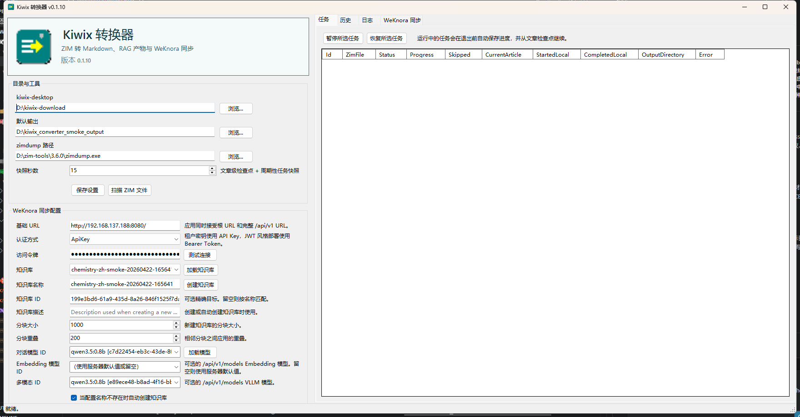

# Kiwix Converter

[](https://github.com/qurikuduo/kiwix_converter/actions/workflows/ci.yml)
[](https://github.com/qurikuduo/kiwix_converter/actions/workflows/release.yml)
[](https://github.com/qurikuduo/kiwix_converter/releases/latest)
[](LICENSE)
[](https://dotnet.microsoft.com/download/dotnet/8.0)
[](https://github.com/qurikuduo/kiwix_converter/releases/latest)
[](#语言版本)

Kiwix Converter 是一个基于 WinForms + SQLite 的桌面工具，用于把 kiwix-desktop 下载的 ZIM 文件转换成按文章拆分的 Markdown 与 RAG 友好型 JSON 产物。

## 语言版本

- English: [README.md](README.md)
- 简体中文: [README.zh-CN.md](README.zh-CN.md)
- 日本語: [README.ja.md](README.ja.md)
- Español: [README.es.md](README.es.md)
- العربية: [README.ar.md](README.ar.md)

## 核心能力

- 扫描已配置的 kiwix-desktop 下载目录，并同步本地 ZIM 文件列表。
- 通过 `zimdump` 读取 ZIM 元数据、文章列表、正文 HTML 和图片资源。
- 只提取正文区域，移除导航和侧边栏，重写内部链接到本地 Markdown 路径。
- 输出 `content.md`、`metadata.json`、`chunks.jsonl`，满足 RAG 导入需要。
- 以 SQLite 保存任务、日志和文章级检查点，支持暂停、恢复和跨会话续跑。

## 运行要求

- Windows
- 运行打包后的桌面程序时需要 .NET 8 Desktop Runtime
- 如果你要从源码编译，则需要 .NET 8 SDK
- `zimdump` 已安装，并且在 `PATH` 中或可在界面里手动指定路径

## 桌面运行文件

- 打包后的桌面程序会优先把运行时数据保存到 EXE 同目录，方便携带和检查。
- SQLite 配置与任务状态保存在 `data/kiwix-converter.db`。
- 启动和运行跟踪日志写入 `logs/kiwix-converter-YYYY-MM-DD.log`。
- 如果发布目录不可写，程序会回退到 `%LocalAppData%\KiwixConverter`。

## 软件截图

下图来自当前 Windows 发布版的真实运行界面。



## 面向普通用户的快速开始

如果你只是想直接使用程序，优先下载 GitHub Release 里的 Windows zip 包，并安装 .NET 8 Desktop Runtime。只有在你准备自己打开解决方案、编译源码时，才需要安装完整的 .NET 8 SDK。

### 1. 安装 .NET

- 直接运行发布包：安装 Windows x64 版 .NET 8 Desktop Runtime。
- 从源码编译：安装 .NET 8 SDK。
- 安装完成后，重新打开终端或重新登录系统，确保 `dotnet` 命令已经进入 `PATH`。

### 2. 安装 `zimdump`

Kiwix Converter 本身不直接读取 ZIM 文件，而是调用 Kiwix 工具链里的 `zimdump`。

Windows 上的常见配置方式：

1. 下载包含 `zimdump.exe` 的 Kiwix tools 压缩包。
2. 解压到固定目录，例如 `C:\Kiwix\tools\`。
3. 选择下面两种方式之一：
  - 把该目录加入 Windows 的 `PATH`
  - 不改 `PATH`，在程序首次启动时手动选择 `zimdump.exe`

Windows 设置 `PATH` 的步骤：

1. 打开“系统属性”。
2. 进入“环境变量”。
3. 编辑用户或系统级的 `Path` 变量。
4. 新增 `zimdump.exe` 所在目录。
5. 关闭并重新打开程序。

### 3. 程序首次启动会检查什么

程序启动时会自动检查 `zimdump` 是否可用。

- 如果找到 `zimdump`，程序正常进入主界面。
- 如果没有找到，程序会弹出提示，并允许你立刻浏览并选择 `zimdump.exe`。
- 即使暂时跳过，程序也可以保持打开，但转换和元数据提取功能会一直不可用，直到你把依赖配置好。

### 4. 如何配置 WeKnora 同步

程序里新增了 `WeKnora Sync Configuration` 区域，作为第一阶段的 RAG 同步目标。

你需要填写或选择：

- WeKnora 基础地址
- 认证方式：`API Key` 或 `Bearer Token`
- 访问令牌
- 知识库 ID 或知识库名称
- 可选的 `KnowledgeQA`、`Embedding`、`VLLM` 模型 ID，可从 `/api/v1/models` 获取
- 当知识库名称不存在时，是否允许程序自动创建知识库

新的同步界面支持：

- 从服务器读取知识库列表
- 先测试连接，再启动同步
- 在创建知识库或启动同步前，应用已配置的聊天、Embedding、多模态模型
- 选择哪些已完成转换的档案要同步到 WeKnora
- 查看同步历史、实时状态、进度条、ETA、日志以及暂停/恢复状态

## 项目结构

```text
KiwixConverter.sln
src/
  KiwixConverter.Core/
  KiwixConverter.WinForms/
docs/
  architecture.md
  wiki/
```

## 架构设计

- `KiwixConverter.WinForms` 负责桌面壳层、设置录入、任务表格、状态展示和人工操作流程。
- `KiwixConverter.Core` 负责扫描、转换、WeKnora 同步和基于 SQLite 的持久化，让界面层保持轻量。
- ZIM 档案访问统一通过 `zimdump` 完成，覆盖元数据、文章列表、正文 HTML 和资源导出。
- WeKnora HTTP API 是 RAG 同步边界，负责知识库发现、模型加载、知识库创建和文章上传。
- 所有长任务都建模为可持久化任务，并带有文章级检查点，因此程序重启后不需要整包重转。

## 技术实现流程

1. 目录扫描阶段先把本地 ZIM 清单 upsert 到 SQLite，然后才进入转换流程。
2. 转换阶段通过 `zimdump` 获取元数据和文章 HTML，再完成正文抽取、链接重写、图片导出，以及 Markdown 和 JSON 产物生成。
3. 每篇文章都会写出 `content.md`、`metadata.json`、`chunks.jsonl` 和检查点，所以失败时只重试真正出错的局部切片。
4. WeKnora 同步阶段会读取已完成导出、从 `/api/v1/models` 加载实时模型 ID、解析或创建带 chunk 参数的知识库，并以可恢复方式按文章上传 Markdown 知识。

## 使用流程

1. 如果你运行的是发布包，请先安装 .NET 8 Desktop Runtime；如果你是从源码运行，请先安装 .NET 8 SDK。
2. 确保 `zimdump` 已安装。
3. 启动程序。
4. 首次运行时设置：
   - `kiwix-desktop` 目录
   - 默认输出目录
   - 可选的 `zimdump` 可执行文件路径
5. 如果启动检查提示 `zimdump` 缺失，先修复 `PATH` 或手动选择 `zimdump.exe`。
6. 点击 `Scan ZIM Files` 扫描本地档案。
7. 在下载列表中选择 ZIM，必要时填写单任务输出覆盖目录。
8. 启动转换任务，并在任务页查看进度、暂停/恢复状态和日志。
9. 若要同步到 WeKnora，打开 `WeKnora Sync` 页，选择一个或多个已完成转换的档案并启动同步任务。

## 自动化构建与发布

- [`.github/workflows/ci.yml`](.github/workflows/ci.yml) 会在 `main` 分支 push 和 PR 时自动编译并上传 Windows 构建产物。
- [`.github/workflows/release.yml`](.github/workflows/release.yml) 现在会在每次 push 到 `main` 时，基于最新的语义化版本标签自动计算下一个 patch 版本并创建新的 GitHub Release。
- 同一个 release workflow 仍然支持手动 `workflow_dispatch`，可在需要时覆盖版本号。
- [`.github/release.yml`](.github/release.yml) 定义自动生成的 release note 模板与分类。

## Wiki 源文档

- 多语言 wiki 内容保存在 [docs/wiki](docs/wiki) 目录下。
- 当前已提供英文、中文、日文、西班牙文、阿拉伯文的主页与发布流程页面。

## 许可证

本项目使用 MIT License。详见 [LICENSE](LICENSE)。